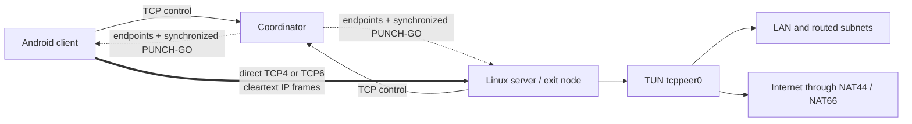

# TCPeer

TCPeer is an experimental, dual-stack, peer-to-peer layer-3 VPN whose outer
transport is always a direct TCP connection. A small coordinator authenticates
peers, discovers their public TCP mappings, exchanges candidates, and
synchronizes TCP simultaneous-open. The coordinator never relays VPN traffic.

> [!WARNING]
> TCPeer is not an encrypted VPN. Only possession of the Secret Key is proven
> with HMAC-SHA256; control metadata and tunneled IPv4/IPv6 packets are sent in
> cleartext. Do not use TCPeer for confidential traffic.

The repository includes:

- a Python coordinator for the control plane;
- a stateful Linux VPN server and exit node;
- an interactive Linux configurator and hardened systemd units;
- a native Android `VpnService` client with a Material 3/Material You UI;
- DHCPv4, IPv6 SLAAC/RA, automatic upstream DNS, NAT44/NAT66, and forwarding;
- a device list, Linux-only PeerNet Hosting administration, and IPv6 TPP ping.

The complete wire-level contract is in
[docs/technical-specification.md](docs/technical-specification.md).

## How it works



The coordinator observes and registers a public address and mapped port for
each available IP family. At a shared start time both peers connect from the
same local TCP port used to create that mapping. This allows TCP
simultaneous-open through compatible NATs.

The direct TCP stream carries framed raw IPv4 and IPv6 packets. The family of
the outer connection does not restrict the inner packets: a TCP6 connection
can transport both IPv4 and IPv6 traffic.

### Transport rules

- TCP is the only outer socket transport. There is no UDP tunnel, QUIC,
  WebRTC, TLS, or DERP-style relay.
- The coordinator carries ASCII control blocks only and never carries VPN
  packets.
- Direct-connect failure is final because TCPeer has no relay fallback.
- Globally reachable IPv6 is preferred when both peers have it.
- ULA, link-local, and private addresses are not advertised as public
  endpoints. A local candidate is used only when both peers are behind the
  same observed public address and share the corresponding local prefix.
- TCP4 is selected when a usable public TCP6 path is unavailable.
- Public address discovery and direct connect use the same configured source
  port. Separate IPv4 and IPv6 mapped ports are registered with the
  coordinator.

TCP hole punching requires endpoint-independent NAT mapping and support for
simultaneous-open. Symmetric/endpoint-dependent NAT, CGNAT policy, aggressive
firewalls, or source-port rewriting can make a direct connection impossible.

## Requirements

### Coordinator

- Python 3.11 or newer;
- a reachable TCP port, `7443` by default;
- a DNS name, IPv4 address, or IPv6 address is accepted by clients.

### Linux server

- Linux with `/dev/net/tun`;
- Python 3.11 or newer;
- `nft`, `ip`, and `sysctl`;
- root for configuration and `CAP_NET_ADMIN` at runtime;
- TCP ports `7443` and `7444` are the defaults for coordinator and direct
  connectivity, but both are configurable.

### Android client

- Android 8.0/API 26 or newer;
- Android VPN permission;
- JDK 17 and Android SDK 36 to build the application.

## Quick start

The examples below use `coordinator.example.net`, network `home`, coordinator
port `7443`, and direct port `7444`. Replace them with your own values and use a
strong Secret Key shared only by peers in the same TCPeer network.

### 1. Install the Python package

On Debian 12 and similar externally-managed Python installations:

```console
sudo python3 -m pip install --break-system-packages .
```

This installs `tcppeer-coordinator`, `tcppeer-server`, `tcppeer-configure`, and
`tcppeer`. The root-level `coordinator.py`, `server.py`, `configure.py`, and
`cli.py` wrappers can also be run directly from the source tree.

### 2. Configure the coordinator

Run the configurator as root and choose `Coordinator`:

```console
sudo python3 configure.py
```

It writes `/etc/tcppeer/coordinator.toml`, installs
`tcppeer-coordinator.service`, reloads systemd, and can enable/start the
service. A minimal manual configuration is available at
[examples/coordinator.toml](examples/coordinator.toml).

```console
sudo systemctl status tcppeer-coordinator --no-pager -l
sudo journalctl -u tcppeer-coordinator -f
```

### 3. Configure the Linux server

Install the same package on the Linux exit node, then run:

```console
sudo python3 configure.py
```

Choose `Server` and provide the same network name and Secret Key used by the
coordinator. The configurator writes `/etc/tcppeer/server.toml` and installs
`tcppeer-server.service`. It must run with `sudo`; execution as an unprivileged
user is rejected. A complete annotated configuration is available at
[examples/server.toml](examples/server.toml).

```console
sudo systemctl status tcppeer-server --no-pager -l
sudo journalctl -u tcppeer-server -f
ip address show tcppeer0
```

### 4. Build and install Android

Set the Android SDK path and build from a terminal:

```console
export ANDROID_HOME="$HOME/Android"
./gradlew :android-app:testDebugUnitTest :android-app:assembleDebug
adb install -r android-app/build/outputs/apk/debug/android-app-debug.apk
```

Open TCPeer, grant VPN permission, and configure:

- Coordinator Address: DNS name, IPv4, or IPv6 without `http://` or brackets;
- Coordinator Port: `7443` by default;
- Network and Secret Key: must match the coordinator;
- Peer ID: unique Android device name;
- Target Peer ID: the Linux server peer ID;
- Direct Port: `7444` by default;
- MTU: `1400` by default.

Tap **Connect**. Disconnect by using the switch at the top of the main screen.

## Android routing and local-network access

Android installs IPv4 and IPv6 default routes through TCPeer, so ordinary
internet traffic uses the Linux exit node. The coordinator and direct sockets
are protected with `VpnService.protect()` to prevent routing loops.

Directly connected physical prefixes are excluded automatically, preserving
access to devices on the current Wi-Fi, Ethernet, or cellular local network.
Android 13 and newer use `VpnService.Builder.excludeRoute()`. Android 8 through
12 receive an equivalent set of split default routes calculated around the
local prefixes. If a physical prefix overlaps a TCPeer overlay prefix, the VPN
overlay wins because both routes cannot represent different networks at the
same destination.

The service watches the underlying Android network. A Wi-Fi/LTE or address
change restarts endpoint discovery instead of continuing to advertise a stale
mapping.

## Exit node, forwarding, NAT, and DNS

When `[exit_node].enabled = true`, the Linux server:

- enables IPv4 and IPv6 kernel forwarding;
- forwards every source subnet arriving through `tcppeer0`, including networks
  routed behind the peer;
- applies NAT44 and NAT66 masquerade when enabled;
- discovers active IPv4/IPv6 upstream interfaces automatically;
- enables nftables software flow offloading when supported and falls back to
  normal forwarding otherwise;
- discovers DNS servers associated with active upstream default routes when
  no explicit DNS list is configured.

```toml
[exit_node]
enabled = true
nat44 = true
nat66 = true
software_flow_offload = true

[ipv6]
# An empty list enables dual-stack upstream DNS discovery.
dns = []
```

The server owns the nftables tables `tcppeer_forward`, `tcppeer_nat44`, and
`tcppeer_nat66`. NAT matches traffic by TUN input interface rather than by one
hard-coded source subnet.

### Host input firewall behavior

Server startup creates `tcppeer_input` and also inserts a rule at the beginning
of existing priority-filter `INPUT` base chains. The inserted rule is tagged
`tcppeer-open-input` and accepts:

- all TCP ports;
- all UDP ports;
- ICMP for IPv4;
- ICMPv6 for IPv6.

Insertion into the existing chains is necessary because an accept verdict in
one nftables base chain does not prevent a later base chain from dropping the
same packet. The tag prevents duplicate insertion after service restarts.

> [!CAUTION]
> This intentionally exposes every listening TCP/UDP service on every server
> interface. A port with no listening process will still report `closed`; the
> firewall rule only prevents it from reporting `filtered` because of an input
> drop. Apply a narrower host firewall if this behavior is unsuitable.

```console
sudo nft -a list table inet tcppeer_input
sudo nft -a list ruleset | grep -C 2 tcppeer-open-input
```

## Address assignment

The Linux server owns a dual-stack layer-3 TUN interface:

- DHCPv4 messages are raw inner UDP/IP packets transported inside the direct
  TCP stream. TCPeer never opens an outer UDP socket for DHCP.
- IPv4 leases are persistent in SQLite and allocated transactionally.
- IPv6 uses Router Solicitation/Advertisement and SLAAC with a `/64` prefix.
- Router Advertisements can carry RDNSS information.
- The same direct TCP stream transports both address families.

## TPP: TCPPeerPing

TCPPeerPing is TCPeer's IPv6-only latency protocol. It uses IPv6 Next Header
`99`, magic `TPP1`, and request/reply timestamps. It is transported as an inner
IPv6 packet through the VPN rather than as an operating-system ICMP socket.

The Android Clients screen provides a **Ping client** action. It opens a
continuous latency view with a scrolling line chart and displays the connected
overlay IPv6 address and current round-trip time.

## Devices and PeerNet Hosting

The Android Clients screen shows known devices and their current metadata:

- online/offline state;
- client or exit-node role;
- Linux or Android platform;
- TCP4 or TCP6 direct transport;
- public and overlay IPv4/IPv6 addresses;
- endpoint and last-seen information.

PeerNet Hosting is optional and Linux-only. The coordinator must enable it and
explicitly list allowed Linux host peer IDs. An authorized host can revoke and
disconnect a client from the Android UI or with:

```console
tcppeer --config /etc/tcppeer/server.toml delete-client PEER_ID
```

Revocations are stored in the coordinator SQLite database.

## Operational CLI

The `tcppeer` command reads the configured server state database:

```console
tcppeer --config /etc/tcppeer/server.toml status
tcppeer --config /etc/tcppeer/server.toml peers
tcppeer --config /etc/tcppeer/server.toml leases
tcppeer --config /etc/tcppeer/server.toml sessions
tcppeer --config /etc/tcppeer/server.toml addresses
tcppeer --config /etc/tcppeer/server.toml transport
tcppeer --config /etc/tcppeer/server.toml stats
```

Runtime state defaults to `/var/lib/tcppeer/server/state.db`. It stores peers,
sessions, byte counters, and DHCP leases. Live TCP streams do not survive a
service restart, but the coordinator connection and peer discovery are
re-established automatically.

## Configuration reference

### Coordinator

| Section | Setting | Purpose |
|---|---|---|
| `listen` | `ipv4`, `ipv6`, `port` | Control-plane listen endpoints |
| `auth.networks` | network-name keys | Shared Secret Key per network |
| `peernet_hosting` | `enabled`, `hosts`, `state_db` | Authorized Linux administrators and revocation state |
| `runtime` | `log_level`, `max_message_size`, `keepalive_seconds` | Coordinator limits and logging |

### Server

| Section | Setting | Purpose |
|---|---|---|
| `coordinator` | `address`, `port` | Coordinator DNS name or numeric address |
| `identity` | `network`, `peer_id`, `secret` | Authentication and device identity |
| `direct` | `ipv4`, `ipv6`, `port`, `target_peer` | Local candidates and coordinated source port |
| `interface` | `name`, `mtu` | Linux TUN settings |
| `exit_node` | `enabled`, `nat44`, `nat66`, `software_flow_offload` | Forwarding and nftables behavior |
| `peernet_hosting` | `enabled`, `admin_socket` | Linux-only client administration |
| `ipv4` | subnet, server, pool, lease | Stateful DHCPv4 settings |
| `ipv6` | prefix, server, RA lifetimes, DNS | SLAAC and RDNSS settings |
| `paths` | `state_db` | Persistent server SQLite database |
| `runtime` | `log_level` | Server logging verbosity |

`direct.ipv4` and `direct.ipv6` may be empty. The server selects suitable local
addresses and asks the coordinator to report public mappings separately. DNS
names are resolved at connection time and can return either or both families.

## Troubleshooting

### `status=203/EXEC`

The systemd unit points to a missing executable. Install the Python package,
then rerun the configurator so it resolves the actual installed path:

```console
sudo python3 -m pip install --break-system-packages .
sudo python3 configure.py
```

### `no endpoint for the required address family`

The coordinator did not receive a usable candidate for the selected family.
Check DNS results, public IPv6 availability, mapped-port discovery, and the
`Registering direct endpoints` journal message on both peers.

### Direct connection fails behind two NATs

Confirm both peers use the same direct port for mapping discovery and the
outbound connection. If that is correct, one of the NATs may use
endpoint-dependent mapping/filtering or may reject TCP simultaneous-open.
TCPeer deliberately has no relay fallback for that case.

### Internet works but the physical LAN does not

Reconnect after changing Wi-Fi/LTE so Android recalculates local-prefix
exclusions. Check for the log message `Keeping directly connected networks
outside TCPeer`.

### Port scanner still reports `filtered`

Verify that `tcppeer-open-input` is the first rule in every normal IPv4 and
IPv6 priority-filter `INPUT` chain. Another firewall manager may have reloaded
its tables after TCPeer started; restart `tcppeer-server` after that reload.
Remember that UDP scanners often cannot distinguish an open silent UDP service
from a filtered port.

### NAT or flowtable setup fails

Run nftables checks as root:

```console
sudo journalctl -u tcppeer-server -n 100 --no-pager
sudo nft list ruleset
sudo ip -4 route show default
sudo ip -6 route show default
```

If the kernel rejects the flowtable, TCPeer logs a warning and retries with
normal forwarding.

## Development and tests

TCPeer's Python runtime uses only the standard library:

```console
python3 -m venv .venv
. .venv/bin/activate
python -m pip install -e '.[test]'
pytest
```

Build and test Android with:

```console
./gradlew :android-app:testDebugUnitTest :android-app:assembleDebug
```

Automated tests cover authentication, ASCII control framing, direct DATA
framing, coordinator policy, mapped ports, DHCPv4, SLAAC/RA, DNS discovery,
TPP, SQLite state, TUN behavior, nftables generation, configurator entrypoints,
and Android protocol/address policy. Unit tests cannot prove that a real NAT or
carrier permits simultaneous-open; validate that on the intended networks.

## Security model

- The Secret Key itself is not transmitted. Peers prove knowledge with an
  HMAC-SHA256 challenge response using a fresh coordinator nonce.
- The Secret Key is stored locally in configuration/preferences and is not a
  substitute for end-to-end traffic encryption.
- Endpoint metadata, device metadata, control messages, DNS traffic, and
  tunneled IP packets are cleartext on the direct TCP stream.
- There is no server identity certificate or TLS authentication.
- PeerNet Hosting can revoke identities but does not encrypt their traffic.

Use application-layer encryption such as HTTPS or SSH inside TCPeer whenever
confidentiality or server authentication matters.

## Project layout

```text
android-app/                 native Kotlin/Compose Android client
docs/technical-specification.md
examples/                    annotated coordinator and server TOML
packaging/systemd/           source service units
src/tcppeer/                 Python package
tests/                       Python automated tests
cli.py                       source-tree CLI wrapper
configure.py                 source-tree configurator wrapper
coordinator.py               source-tree coordinator wrapper
server.py                    source-tree Linux server wrapper
```

## License

Apache License 2.0. See [LICENSE](LICENSE).
